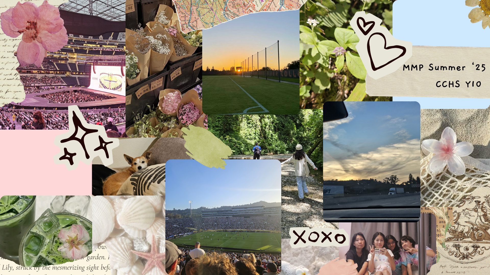

# Me in Markdown

## Introduction

Hi! My name is Madeleine Martinez Park. I am currently in 10th grade and playing soccer. I have been playing soccer since I was 4 years old (11 years). I played on CCHS JV soccer team my freshman year and hope to make the team again for my sophmore year.

This summer my family and I went to the Redwoods National Park and went to the nearby Fern Canyon which was byfar my favorite summer memory. We stayed close to the Redwoods Forest in Orick for around a week. We went on several hikes, sightseeing, and saw several herds of deer and elk.

My favorite food that I enjoyed this summer was tteok guk (a Korean rice cake soup), it is memorable to me because in Korean culture eating this soup would give you "good luck" for the year. My favorite book is "Crying in H-Mart" by Michelle Zauner who is also in one of my favorite groups (Japanese Breakfast). "Crying in H-Mart" is a book about Zauner's relationship with her mother and how after she died, people could always find her crying in H-Mart; reminicing her time with her mom.

## Playlist

[My Spotify playlist](https://open.spotify.com/playlist/3Qjb0qZKuCLqfvvc68c87L?si=I2L9NutNQUeTRNm2imFlLw)

## Collage / Moodboard

